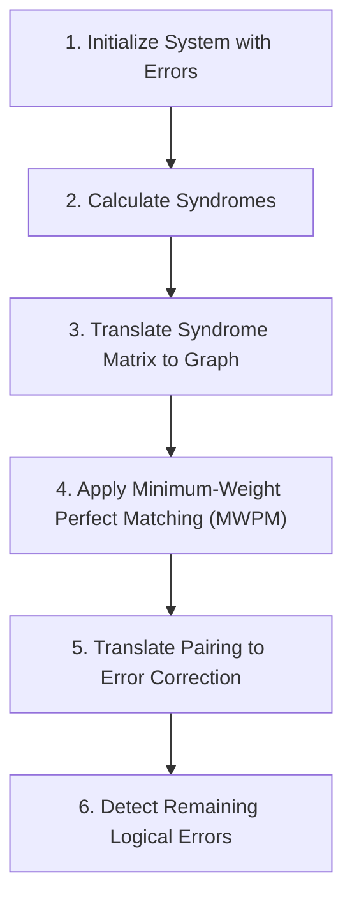

# Topological Qubit Error Correction on a Torus (Donut)

This repository contains the simulation framework and analysis for topological quantum error correction (QEC) on a torus (periodic boundary conditions), comparing standard Toric codes ($XXXX$ and $ZZZZ$ stabilizers) with the $XZZX$ stabilizer code configuration under biased noise models.

**Challenge #7 Team:** Leif, Rose, Vijay, and Gehad  
**Supervisor:** Elena  
**Sponsors:** Dunkin' Donuts & Digi (Digitally Enhanced Quantum Technology Master)

---

## Project Overview

Quantum systems are highly susceptible to noise. Unlike classical error correction which can use simple replication and majority voting, quantum error correction must overcome three major obstacles:
1. **No-Cloning Theorem:** An arbitrary, unknown quantum state $|\psi\rangle$ cannot be copied.
2. **Wavefunction Collapse:** Measuring the qubits directly collapses their state.
3. **Continuous Errors:** Errors are not just discrete bit-flips, but can be arbitrary rotations on the Bloch sphere.

To bypass these issues, we utilize **Stabilizer Codes** (specifically the **Toric Code**) where we measure multi-qubit joint operators (stabilizers) that do not collapse the logical quantum state but do reveal the presence and location of errors (syndromes).

---

## Stabilizer Codes & The Toric Code

* **Stabilizers ($S_i$):** Operators that leave the code space invariant:
  $$S_i |\psi\rangle = |\psi\rangle \quad \forall i$$
* **Error Detection:** If an error $E$ anti-commutes with a stabilizer $S_i$, measuring the stabilizer yields a $-1$ eigenvalue, signaling an error:
  $$S_i (E|\psi\rangle) = -E S_i|\psi\rangle = -(E|\psi\rangle)$$

### Toric (Donut) Code Lattice
By wrapping a square lattice on a torus (imposing periodic boundary conditions), we can encode **2 logical qubits**. 

* **$Z$ Stabilizers (Plaquettes):** Detect $X$ (bit-flip) errors.
* **$X$ Stabilizers (Vertices):** Detect $Z$ (phase-flip) errors.

```
       Z                     X
    [ Qubit ]             [ Qubit ]
  Z - Pla - Z           X - Star - X
    [ Qubit ]             [ Qubit ]
       Z                     X
```

---

## Simulation Workflow

The simulation pipeline follows these key steps:



1. **Initialize System with Errors:** Apply random $X$ and $Z$ errors to the physical qubits with a given error probability $p$.
2. **Calculate Syndromes:** Measure the stabilizer generators. Qubits with $-1$ measurement outcomes form the syndrome boundaries (defects).
3. **Translate Syndrome Matrix into Graph:** Construct a syndrome graph where nodes represent the flipped stabilizers.
   * **Unweighted:** Edge weight is defined by the Manhattan distance: $dx + dy$
   * **Weighted:** Edge weight is adjusted for biased noise: $dx \cdot w_x + dy \cdot w_y$
4. **Apply Minimum-Weight Perfect Matching (MWPM):** Pair the syndromes in a way that minimizes the total path weight (e.g., using `pymatching` or `networkx`).
5. **Translate Pairing into Error Correction:** Construct a correction operator along the matched paths.
6. **Find Remaining Logical Errors:** Combine the error and the correction operator. If the result forms a topologically non-trivial closed loop (homology cycle) wrapping around the torus, a logical error has occurred.

---

## Core Findings & Features

* **Error Rate Threshold:** The threshold for the standard toric code is around **1.2%**. The MWPM algorithm scales with $O(n^3 \log n)$ complexity.
* **XZZX Code vs. Toric Code:** The $XZZX$ code coordinates stabilizers as mixed $X$ and $Z$ operators. Under highly biased noise (where phase-flip errors are much more common than bit-flip errors), the $XZZX$ code exhibits a higher threshold and significantly lower logical failure rates compared to the standard code.
* **Weighted Matching:** Adjusting the graph weights based on noise bias ($w_x$ vs. $w_y$) improves the decoder performance under biased noise.

---

## Setup & Running the Code

1. **Clone the repository:**
   ```bash
   git clone https://github.com/PedersenL/Topological-Qubit-Error-Correction-on-a-Torus.git
   cd Topological-Qubit-Error-Correction-on-a-Torus
   ```

2. **Install dependencies:**
   ```bash
   pip install -r requirements.txt
   ```

3. **Explore the Notebooks:**
   Open the Jupyter environment to run the simulations:
   ```bash
   jupyter notebook
   ```
